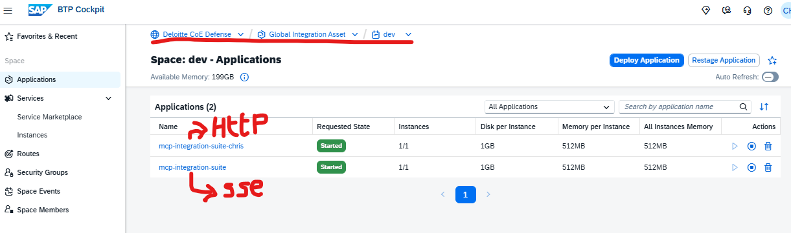
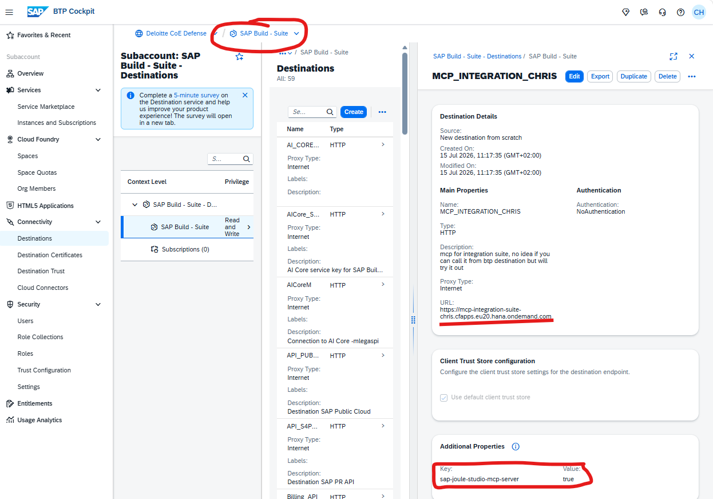
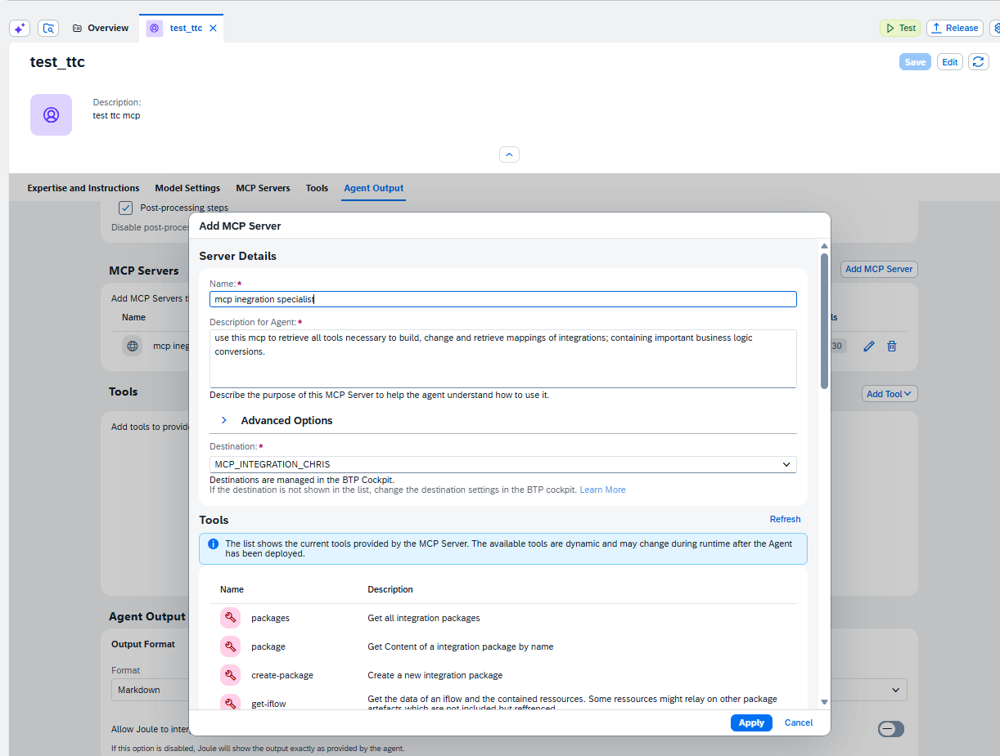

# Deploying to Cloud Foundry & Connecting Joule

This guide covers running the MCP Integration Suite server as a **remote HTTP service on
SAP BTP Cloud Foundry** and connecting it to **Joule**. For local `stdio` usage with
Claude Desktop / Cline, see the main [README](README.md) instead.

> ⚠️ **Security:** the deployed `/mcp` endpoint is currently **unauthenticated** — anyone who
> can reach the route can run every tool against your Integration Suite tenant. Read
> [Securing the endpoint](#10-securing-the-endpoint) before exposing it beyond a trusted,
> private network.

## Contents
1. [How it works](#1-how-it-works)
2. [Prerequisites](#2-prerequisites)
3. [Build](#3-build)
4. [Log in to Cloud Foundry](#4-log-in-to-cloud-foundry)
5. [Deploy the app](#5-deploy-the-app)
6. [Configure credentials (environment variables)](#6-configure-credentials-environment-variables)
7. [Verify the server](#7-verify-the-server)
8. [Inspect with the MCP Inspector](#8-inspect-with-the-mcp-inspector)
9. [Connect to Joule](#9-connect-to-joule)
10. [Securing the endpoint](#10-securing-the-endpoint)
11. [Optional: use a BTP destination for the CPI API](#11-optional-use-a-btp-destination-for-the-cpi-api)
12. [Troubleshooting](#12-troubleshooting)

---

## 1. How it works

The server has **two entry points**:

| Entry point | Transport | Used by | Command |
|---|---|---|---|
| `dist/index.js` | stdio | Local clients (Claude Desktop, Cline) | `node dist/index.js` |
| `dist/server-http.js` | Streamable HTTP | Remote clients on CF (e.g. **Joule**, MCP Inspector) | `node dist/server-http.js` |

On Cloud Foundry the HTTP entry point ([src/server-http.ts](src/server-http.ts)) exposes:

| Method + path | Purpose |
|---|---|
| `GET /health` | Health check → `{"status":"ok", ...}` |
| `POST /mcp` | MCP JSON-RPC messages (Streamable HTTP) |
| `GET /mcp` | Server→client notification stream |
| `DELETE /mcp` | Terminate an MCP session |
| anything else | `404` |

> ⚠️ **Transport: Streamable HTTP — this is what Joule requires.** It is the current MCP HTTP
> transport and replaces the older, now-deprecated **HTTP+SSE** transport. Consequently there
> is no `/sse` endpoint here, and every client (Joule, the MCP Inspector, etc.) must be set to
> *Streamable HTTP*, not SSE.

In the CF Applications list this is the difference between the two apps:
`mcp-integration-suite-chris` runs the **HTTP (Streamable HTTP)** entry point used by Joule,
while the older `mcp-integration-suite` runs the deprecated **SSE** transport.



The app reads its SAP Integration Suite credentials from **environment variables**
(see [Section 6](#6-configure-credentials-environment-variables)). On Cloud Foundry the
local `.env` file is **not** used — `.cfignore` excludes it from the upload.

---

## 2. Prerequisites

- **Node.js ≥ 20** and npm (native `fetch` is required).
- **Cloud Foundry CLI** (`cf`) — <https://docs.cloudfoundry.org/cf-cli/install-go-cli.html>.
- Access to the target BTP **org / space** (this app targets org
  `Deloitte CoE Defense_coe-defense-cpi-test-zw63p01k`, region **eu20**).
- SAP Integration Suite **API access**, either:
  - an **OAuth** service key for the Process Integration Runtime (`api` plan) — client id,
    secret, token URL; **or**
  - a **basic-auth** S-user (`S00…`) + password.

---

## 3. Build

```sh
npm install
npm run build
```

This runs the OData client generation + `tsc`, producing `dist/`.

---

## 4. Log in to Cloud Foundry

```sh
cf login -a 'https://api.cf.eu20.hana.ondemand.com' \
  -o 'Deloitte CoE Defense_coe-defense-cpi-test-zw63p01k' \
  -u <your-email>
```

(A convenience script exists at [login.sh](login.sh).)

---

## 5. Deploy the app

```sh
cf push
```

This uses [manifest.yml](manifest.yml):
- **app name:** `mcp-integration-suite-chris`
- **command:** `node dist/server-http.js`
- **buildpack:** `nodejs_buildpack`
- `PUPPETEER_SKIP_DOWNLOAD=true` (the `iflow-image` diagram tool is disabled on CF to stay
  within the disk quota).

Files uploaded are filtered by [.cfignore](.cfignore) — note it **excludes `src`,
`node_modules`, and `.env`**, so you must `npm run build` first (step 3) and set config via
env vars (step 6).

Get the public route:

```sh
cf app mcp-integration-suite-chris
```

Note the `routes:` value, e.g.
`https://mcp-integration-suite-chris.cfapps.eu20.hana.ondemand.com`. Your MCP endpoint is
that route **+ `/mcp`**. Referred to below as `<CF_ROUTE>`.

---

## 6. Configure credentials (environment variables)

> The deployed app does **not** read your local `.env` — `.cfignore` strips it from the
> push. Configure credentials in Cloud Foundry instead.

Required: `API_BASE_URL` **plus one** authentication method.

### Option A — OAuth (recommended)

```sh
cf set-env mcp-integration-suite-chris API_BASE_URL 'https://<tenant>.it-cpi0xx.cfapps.eu20.hana.ondemand.com/api/v1'
cf set-env mcp-integration-suite-chris API_OAUTH_CLIENT_ID '<client-id>'
cf set-env mcp-integration-suite-chris API_OAUTH_CLIENT_SECRET '<client-secret>'
cf set-env mcp-integration-suite-chris API_OAUTH_TOKEN_URL 'https://<tenant>.authentication.eu20.hana.ondemand.com/oauth/token'

cf restage mcp-integration-suite-chris
```

### Option B — Basic auth

```sh
cf set-env mcp-integration-suite-chris API_BASE_URL 'https://<tenant>.it-cpi0xx.cfapps.eu20.hana.ondemand.com/api/v1'
cf set-env mcp-integration-suite-chris API_USER '<S-user>'
cf set-env mcp-integration-suite-chris API_PASS '<password>'

cf restage mcp-integration-suite-chris
```

### Optional — CPI test messages

Only needed for the `send-http-message` tool (OAuth only):

```sh
cf set-env mcp-integration-suite-chris CPI_BASE_URL 'https://<tenant>.it-cpi0xx.cfapps.eu20.hana.ondemand.com'
cf set-env mcp-integration-suite-chris CPI_OAUTH_CLIENT_ID '<client-id>'
cf set-env mcp-integration-suite-chris CPI_OAUTH_CLIENT_SECRET '<client-secret>'
cf set-env mcp-integration-suite-chris CPI_OAUTH_TOKEN_URL 'https://<tenant>.authentication.eu20.hana.ondemand.com/oauth/token'
cf restage mcp-integration-suite-chris
```

**Important notes**
- **Use single quotes.** OAuth secrets often contain `$`, and client IDs contain `!` / `|`;
  double quotes let the shell mangle them.
- **`cf restage` (or `cf restart`) is required.** `cf set-env` only stores the value — the
  running process keeps its old environment until you restage.
- **Persistence:** values set with `cf set-env` are stored in the app config and survive
  `cf restart`, `cf restage`, and future `cf push` deployments. They remain until you
  `cf unset-env <app> <VAR>` (then restage) or `cf delete` the app.
- **Inspect current values:** `cf env mcp-integration-suite-chris` (shown in plaintext under
  *User-Provided*, so anyone with access to the space can read them).

---

## 7. Verify the server

```sh
curl https://<CF_ROUTE>/health
# {"status":"ok","service":"mcp-integration-suite-chris"}
```

If the tools later error with `No API Url provided in project .env file`, the env vars aren't
set / the app wasn't restaged — see [Troubleshooting](#12-troubleshooting).

---

## 8. Inspect with the MCP Inspector

```sh
npx @modelcontextprotocol/inspector
```

In the Inspector UI:
- **Transport Type:** `Streamable HTTP`  *(not SSE)*
- **URL:** `https://<CF_ROUTE>/mcp`

Then connect and try the `packages` tool. To test the local stdio build instead, run
`npx @modelcontextprotocol/inspector node ./dist/index.js` (this is the `npm run dev`
target).

---

## 9. Connect to Joule

Connecting Joule is two steps: create a **BTP destination** that points at this server, then
add it as an **MCP Server** inside **Joule Studio**.

> 🔒 **Security:** the `/mcp` endpoint is currently **unauthenticated**, and the destination
> below uses `NoAuthentication` to match — see [Securing the endpoint](#10-securing-the-endpoint)
> before exposing it. Once you add authentication to the server, update this destination's
> **Authentication** to match.

### 9.1 Create the BTP destination

In **BTP Cockpit → the subaccount where Joule Studio runs** (here *SAP Build - Suite*, which
may differ from the CF org/space where the app is deployed) → **Connectivity → Destinations →
Create**:

| Field | Value |
|---|---|
| Name | e.g. `MCP_INTEGRATION_CHRIS` (you reference this from Joule Studio) |
| Type | `HTTP` |
| URL | the app's **base route** — e.g. `https://mcp-integration-suite-chris.cfapps.eu20.hana.ondemand.com` |
| Proxy Type | `Internet` |
| Authentication | `NoAuthentication` (until the endpoint is secured — see §10) |
| **Additional Property** | **`sap-joule-studio-mcp-server` = `true`** |

The `sap-joule-studio-mcp-server = true` additional property is what makes Joule Studio
recognise the destination as an MCP server — without it, it won't appear in the Joule Studio
dropdown. The URL is the **base route with no `/mcp` suffix**; Joule targets the server's
`/mcp` endpoint from it.



### 9.2 Add the MCP server in Joule Studio

In **Joule Studio**, open (or create) an agent → **MCP Servers** tab → **Add MCP Server**:

| Field | Value |
|---|---|
| Name | a label for the server, e.g. `mcp integration specialist` |
| Description for Agent | when the agent should use it, e.g. *"use this mcp to retrieve all tools necessary to build, change and retrieve mappings of integrations…"* |
| Destination | the destination from §9.1 (`MCP_INTEGRATION_CHRIS`) |

Once the destination is selected, Joule discovers and lists the server's tools (`packages`,
`package`, `create-package`, `get-iflow`, …). Click **Apply**, then **Save** the agent.



---

## 10. Securing the endpoint

> ⚠️ **Current state: the `/mcp` endpoint is unauthenticated.**
> [server-http.ts](src/server-http.ts) serves `/mcp` to any caller that can reach the route —
> there is no API key, token, or identity check. Every MCP tool then runs against your
> Integration Suite tenant using the credentials from
> [Section 6](#6-configure-credentials-environment-variables). On a shared or public Cloud
> Foundry landscape — and especially a defense tenant — **anyone who learns the route URL can
> read, create, deploy, and delete integration content and send messages.**

### Immediate mitigations (no code change)

- Treat the route URL as a secret; don't share it. If it may have leaked, rotate the CPI
  credentials (`cf set-env` the new values, then `cf restage`).
- Restrict inbound access at the network / route level where your landscape allows it.
- Use least-privilege CPI credentials — a service key scoped to only what you actually need.

### Proposed next steps (increasing effort / robustness)

1. **Shared bearer token — quick win.** Add a check in
   [server-http.ts](src/server-http.ts) that compares the incoming
   `Authorization: Bearer <token>` header against an `MCP_AUTH_TOKEN` env var and returns
   `401` on `/mcp` when it's missing or wrong. Set the token with `cf set-env` and store the
   same value in the Joule MCP destination. ~20 lines, no new dependencies — closes the open
   door immediately.

2. **XSUAA / JWT validation — BTP-native.** Bind an **XSUAA** service instance to the app and
   validate the incoming JWT and its scopes (e.g. with `@sap/xssec`). Joule's destination
   supplies an OAuth2 client-credentials token. Integrates with BTP role management and avoids
   a shared static secret.

3. **App Router / API Management in front — strongest.** Front the app with a CF **approuter**
   (or API Management) that enforces authentication (XSUAA / IAS) before traffic reaches the
   Node process, and keep the app route internal. Centralizes auth and adds proper session
   handling.

**Recommended path:** ship **(1)** now to close the open door, then move to **(2)** for a
proper BTP-native setup.

---

## 11. Optional: use a BTP destination for the CPI API

Instead of storing the CPI credentials as app env vars (Section 6), you can keep them in a
**BTP Destination** and have the MCP server resolve it by name. Benefits: secrets managed
centrally in the subaccount, easier rotation, nothing sensitive in the app environment.

> ⚠️ This is **not implemented today.** [api_destination.ts](src/api/api_destination.ts)
> builds the destination inline from `process.env`. Switching to a named destination requires
> the changes below.

1. **Create an HTTP destination** in the subaccount (Connectivity → Destinations) pointing at
   the API base URL, with `Authentication = OAuth2ClientCredentials` (client id/secret/token
   URL).
2. **Bind services to the app** — the **Destination** service and **XSUAA** (Authorization &
   Trust Management) instances — so the Cloud SDK can read the destination at runtime.
3. **Change the code** so `getCurrentDestination()` calls the Cloud SDK's
   `getDestination({ destinationName: process.env.DESTINATION_NAME })` instead of assembling
   the destination from `API_*` env vars.

Do **not** confuse this with the **Joule → MCP** destination in Section 9: that one points
Joule *at this server*; this one points *this server at the CPI API*.

---

## 12. Troubleshooting

| Symptom | Cause | Fix |
|---|---|---|
| `Proxy Server PORT IS IN USE at port 6277` | A previous MCP Inspector run left orphaned node processes (the proxy on `6277`, client on `6274`). | `lsof -ti :6277 -ti :6274 \| xargs -r kill` (macOS/Linux), or start with `SERVER_PORT=6278 CLIENT_PORT=6275 npx @modelcontextprotocol/inspector`. Stop the Inspector with `Ctrl+C` to avoid orphans. |
| `404` when connecting | Wrong path or transport. The server only serves `/mcp` over **Streamable HTTP**; every other URL returns `404`, and there is no `/sse`. | Set URL to `https://<CF_ROUTE>/mcp` and Transport to `Streamable HTTP`. |
| `Error: No API Url provided in project .env file` | `API_BASE_URL` is empty at runtime. On CF this means env vars weren't set, or were set but the app wasn't restaged. Editing the local `.env` has no effect on CF. | Run the `cf set-env` commands (Section 6) then `cf restage`. Confirm with `cf env <app>`. |
| Tools fail after `cf set-env` | App still running with old environment. | `cf restage mcp-integration-suite-chris` (or `cf restart`). |
| Diagram / `iflow-image` tool not working on CF | Chromium download is skipped via `PUPPETEER_SKIP_DOWNLOAD=true` to fit the disk quota. | Expected on CF. Use the local stdio deployment for diagram rendering. |

For deeper diagnostics: `cf logs mcp-integration-suite-chris --recent`.
